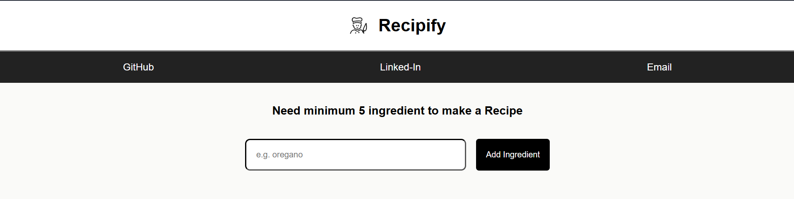
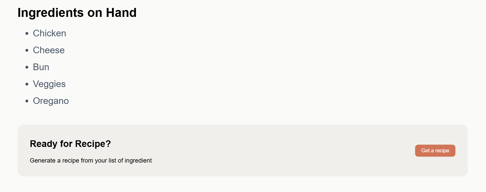
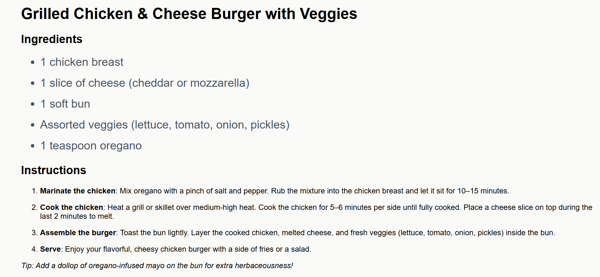

# Recipify

## Description

Recipyfy is an AI-powered recipe generator that creates cooking instructions based on the ingredients you provide. By leveraging a simple React frontend and an Express backend, it showcases how AI APIs can be integrated into a modern web application. The project focuses on learning and understanding the React ecosystem, backend fundamentals, and end‑to‑end app structure.

## Project Vision / Next Steps

### Why

This project was created to deepen understanding of:

* React and its ecosystem
* Backend development with Express
* Connecting frontend and backend in a practical project

### Next Step

The long‑term vision is to evolve Recipyfy into a full‑fledged shopping application built using:

* **TypeScript + React**
* **Redux Toolkit**
* **Prisma**
* **MongoDB or PostgreSQL**

## Features

* Users can input ingredients to generate recipes.
* Minimum of **5 ingredients** required before unlocking the **Get Recipe** button.
* App sends ingredients to the backend, which generates a recipe in Markdown format.
* Markdown is rendered beautifully in the UI using **ReactMarkdown**.
* Simple and fast ingredient‑to‑recipe workflow.

## Tech Stack

### Frontend

* React
* TypeScript
* Redux (global state management)
* Axios

### Backend

* Express
* No database used

## Prerequisites

* Node.js (must be installed)
* npm or pnpm (recommended: **pnpm** for faster installs)

## Installation

1. Generate an access token from Hugging Face and place it inside your `.env` file.
2. Clone the repository:

   ```bash
   git clone <repo-url>
   ```
3. Install dependencies:

   ```bash
   cd client
   pnpm install

   cd ../server
   pnpm install

   pnpm install
   ```
4. Run the development servers:

   ```bash
   cd client
   pnpm dev
   ```

   ```bash
   cd server
   pnpm start
   ```

## Usage

* Enter at least **five ingredients**.
* Click **Get Recipe**.
* View the AI‑generated recipe rendered in rich HTML formatting.

## Dependency Information

Dependencies can be viewed directly inside the `package.json` folder of client and server respectively.

## Screenshots

 



## License

No license.

## Thank You Note

Thank you for checking out Recipyfy! Your support and interest are appreciated.
